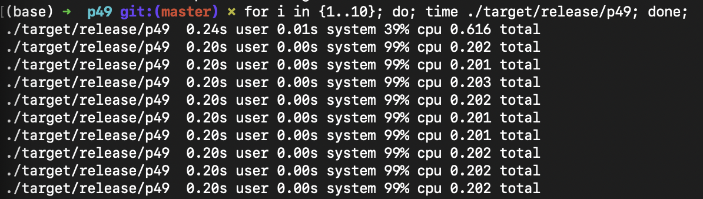
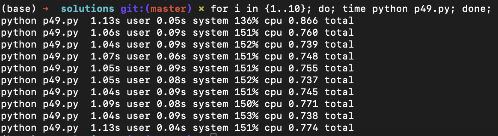

I solved this problem in rust and it ran really fast, so I was curious about how much faster it would run in python, so I translated it into python. The Rust script executes 5x faster than the python script. 

This is the runtime in rust

And this is the runtime in python

Note: in the above images I took out the print statements but the scripts are otherwise exactly the same. 
